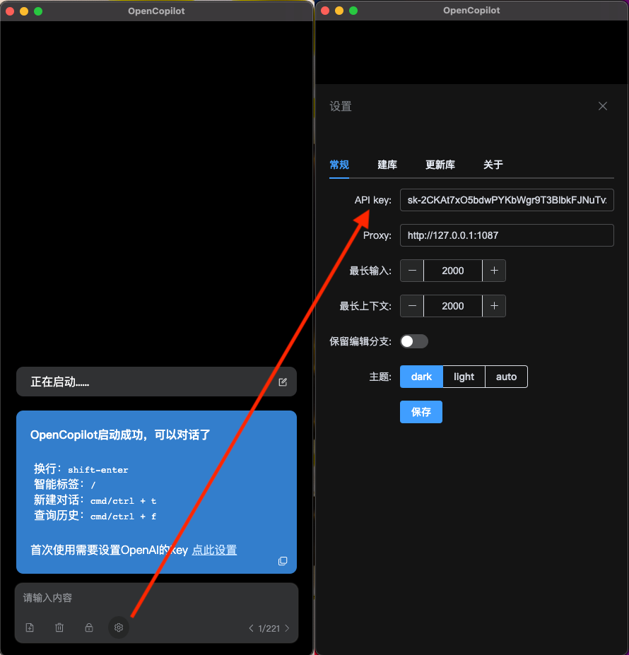

## 概述

OpenCopilot是一个可以常驻桌面随时使用ChatGPT的桌面应用。无需打开网页或切换窗口，随时随地在你的工作流中和AI聊天。还有诸如本地知识库，google联网等功能。本地部署，需要OpenAI的key，支持MacOS和Windows。


## 特点

- 无框常驻模式，融入工作环境
- 通过斜杠“/”添加扩展标签，组合各种扩展功能
- 构建本地知识库
- 长文本全文阅读
- 自定义prompt
- 联网搜索插件
- 本地管理对话记录  

## 安装

### 一、打包版

打包好的版本，开箱即用

Mac OS：https://github.com/newfyu/OpenCopilot/releases    
Mac上如果提示什么文件损坏，安全权限问题，在“通用”-“隐私与安全”中打开。如果使用了本地知识库，读取本地文件时也会有权限提示。

Windows(x64)：https://github.com/newfyu/OpenCopilot/releases    

(百度云下载地址：链接: https://pan.baidu.com/s/1B1JYtURbM90u344-X2rQZA 提取码: 1234）

### 二、源码安装

OpenCopilot由brainshell和braindoor两个项目打包而成。

Braindoor主要用于快速构建chatgpt本地知识库，后来陆续增加了一些七七八八的小功能。具体安装方法参考： https://github.com/newfyu/Braindoor

Brainshell提供了无框常驻模式，目标是把AI融合到日常工作中，也让braindoor放弃难用的web ui。项目地址： https://github.com/newfyu/Brainshell

先启动braindoor，会开启一个本地服务。然后启动brainshell后会尝试和它连接，连接成功即可使用。

## 基本配置

窗口模式下，点击“齿轮”图标，填入OpenAI的key。如果你的网络无法访问openai，还需要下面填入代理地址。  



## 常规使用

启动后是窗口模式，和日常的窗口应用没有区别，可以任意调整大小和位置。

调整到合适大小和位置后，点击“锁”图标后变成无框模式，将置顶并且不能调整大小，但仍可以通过“手”按钮拖动位置。建议放置到屏幕左下角或右下角，就像网络游戏的聊天窗口一样，无框透明设计方便融入日常大部分工作环境。当然也有喜欢只用窗口模式的，看个人习惯吧。

- Enter键是提交
- Shift-Enter是换行
- 斜杠“/” 会开启一个扩展标签的选择列表，提供扩展功能。标签可以通过缩写查询。
- 下方四个按钮分别是“新建对话”，“删除对话”，“无框模式”，“设置”。进入无框模式后，设置按钮变为拖动按钮

## 全文阅读

用于处理较长的文档，可以超过ChatGPT的token长度限制


有两种方式启用

- 如果粘贴一大段文字到输入框中提交，超过预设的限制（默认2000，可在config.yaml中修改），会自动转成全文阅读模式
- 拖拽一个文件（txt, md, pdf, html, docx）到输入框后，也会开启全文阅读模式。然后可以对该文本中内容进行问答。

全文阅读的原理是分块阅读，就是带着问题，分块阅读所有文档片段并储存中间相关信息，最后汇总。这个方案不是把文档分块后用向量查询。向量查询有两个缺点，一个是如果你的问题在文中和上下文关系不大，可能查询不到。另一个是如果你的问题，需要整合全文各个部分信息后才能总结得出，也是无法完成的。全文阅读无论是细节的查询还是整体的查询都更好，但缺点也很明显，就是token消耗更大。所以比较适合的是2万token以内的文章，需要文档分析准确度的场景。如果你需要分析的文本特别大，比如要针对几万几十万字的一本书进行问答，建议使用下面的“本地知识库”，把书本变成一个知识库，那个是使用向量查询的方案（embeding）。

下面是一些常用的全文阅读模式的提问方式，这些提问既有关注局部的也有关注全局的，基本上都能很好完成

- **总结文献：**"总结一下这篇文献，关注和解决了一个什么问题，使用了什么方法，效果如何，有什么意义"
- **概括文件：**"按顺序总结一下文件中提到的重要时间点和相应的安排，用markdwon表格输出，包括时间点，安排"
- **提取原文信息：**"提取所有文中关于xxx相关的原文信息，使用json输出，字段'原文信息'"
- **续写(需要创作原文中没有的内容, 建议先总结再发挥）**: "简单总结一下文中提到的这个项目的基本情况，然后根据基本情况写一下文中的项目市场前景预测，经济效益与社会效益"
- **作为背景资料：**"根据提供的文字作为背景资料，续写一下该项目项目创新点与技术优势。可以根据你的知识自由发挥。"

## 扩展标签

使用斜杠选择，插入后会提供额外的功能，简称etag。etag有五种类型，“prompt",  "base",  "model",  "engine",  "agent"     

### Prompt 提示词

就是提示词模板了，插入prompt标签后，会对你输入的内容进行包装（添加提示词）

prompt标签可以插入多个，会从前到后依次包装你的输入

支持用户编写，模板文件在`用户文件夹/braindoor/prompts`下面，每一个prompt都是一个简单易读的yaml文件，可以参考下面的格式自己写prompt

```yaml
# fanyi.yaml
name: 翻译成中文   # 会提取为标签名
description: 用于把中文翻译成英文 # 描述，暂时没用可以随便写，以后用于自动选择prompt
# template注意每段文字前面的缩进要对齐。{text}中的内会被替换为你的输入内容
template: |
    你的任务是用正式的语气把下面三个反引号中的文字翻译为中文：
    ```{text}```
```

需要重启程序才会载入新的prompt标签

自带的几个prompt作为模板参考，更多的是建议用户自己管理自己的prompt

    

### Base 本地知识库

本地知识库功能。插入base后，对话时将主要根据本地知识库中的内容来回答问题，用于构建特定领域的问答机器人。

本地知识库需要预先创建，在设置按钮中的“建库”中创建。创建时需要指定一个索引文件夹（可筛选txt, md，html, docx, pdf）按设定的大小（建议1000-2000token）切片后再通过openai的text-ada-002模型向量化后存储到本地 `用户文件夹/braindoor/bases`文件夹。（会连接openai，有敏感信息的小心泄露风险！）。建库的时候，一个知识库只添加一个索引文件夹。后续可以在“更新库”中增加更多的文件夹。   

如果索引文件中的文件内容发生改变，点“更新库”，会增量更新改动。

插入base标签后，对话时将AI首先根据本地知识库中的相关内容来回答，如果查询不到相关的片段，才根据自己的知识回答。查询到的本地信息，会列出一个链接，点击后可从外部浏览器查看。

base文件是可以共享的，比如你用某些资料做了一个特定知识的聊天机器人，你把base文件复制给别人仍然是可以正常问答的，不必要再传到openai去向量化一次。  

插入多个base标签，会在多个本地库中搜索


### Model 模型选择

用于选择语言模型和调整语言模型的参数，目前只能选ChatGPT (gpt3.5-turbo) 和GPT3 (text-davinci-003)。后面版本再加入gpt4等（我没API啊😭）或本地部署的模型

不插入任何模型标签，默认是一个温度0.8的chatgpt。但如果你需要一些特定参数chatgpt，比如调整温度，调整最大token数等，改变system message，只要是官方API的参数都可以传入。方法是在`用户文件夹\braindoor\models`中添加模型配置文件。每个文件是一个yaml文件，按下面格式写就可以了。

```yaml
# chatgpt_t0p8.yaml
model: chatgpt # 可以填chatgpt或gpt3
params: # 除了stream和message/prompt不要传入，其他官网API支持的参数都可以传入来调整模型
    max_tokens: 1500
    temperature: 0.8
system_message: "you are a help assistant" # 输入系统message
```

注意model配置文件的文件名会被识别为标签名，所以不要有空格。     

重启程序后，即可以在标签中选择该模型。

### Engine 内置功能

这类标签是写入braindoor内部的功能，不能通过配置文件来增加。自带了哪些就是哪些，每次版本更新的时候会添加一些。目前有：

- /HyDE：在使用本地知识库的时候，默认是根据你的问题去查询相似的文档片段。插入HyDE后，会先根据你的问题生成一个预先答案，再通过该答案去查询本地相关片段。可以增加片段查询的准确率，会增加一点token消耗
- /ReadTop3：和本地知识库配合使用，增加本地知识库阅读深度。使用本地仓库时，默认只根据相似度最高的片段作为上下文，插入该标签后，会使用相似度最高的前3个片段作为依据，然后用分块阅读来解答问题，会增加token消耗，但提高查询准确率。
- /ReadTop5：同上，会使用相似度最高的5个片段
- /Memo：备忘录，插入这个标签后，输入后不会经过LLM，直接就输出你输入的内容。有人说，这不扯淡吗。其实就是用来记录一下笔记，当个桌面便签。支持markdown。

### Agent 智能体

相对高级的插件功能，可以方便的本地python和gpt结合起来执行任意的自动化操作

内置了二个基本Agent，主要是用于网络搜索改善回答的真实性

**google_search**：插入该标签后，会生成搜索词然联网查询google的结果。这只是一个轻量级的联网搜索插件，此插件只会读取搜索结果的摘要，不会深入阅读网页。经过测试，对于回答一般的事实性问题是足够的了。等将来token充裕后，再加入深度搜索网页内容的agent。


**wiki**：插入该标签后，会查询wikipedia的结果后回答，和上面插件一样，会读取wikipedia提供的summary。


Agent可以方便的自己实现，只需要简单的python脚本，就能根据自己的需求自己编写任何和大语言模型结合的功能。wiki插件中提供了详细的注释，可以参考实现自己的Agent。python是调用的本地环境，没有任何限制，想做什么都可以，如果你不害怕GPT删库跑路，甚至可以写脚本完全接管你的电脑。下一版再考虑内置一个现对安全的调用Applescript的agent和沙盒中运行的的Python REPL Agent。

## 其他配置

不常用的配置可以在`用户文件夹/braindoor/config.yaml`文件中找到，可以参考[braindoor]( https://github.com/newfyu/Braindoor)的参数说明。

## 错误信息

使用cmd-shift-i可以打开开发者工具，运行日志都传入到其中，遇到问题可以先大致看下错误是什么，再反馈给我，非常感谢。

另外braindoor的日志文件，在`用户文件夹/braindoor/run.log`下
