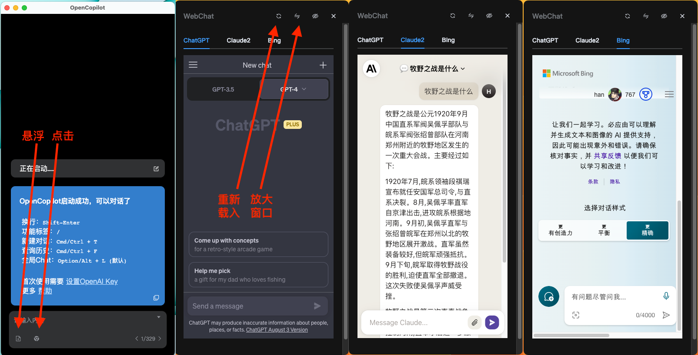
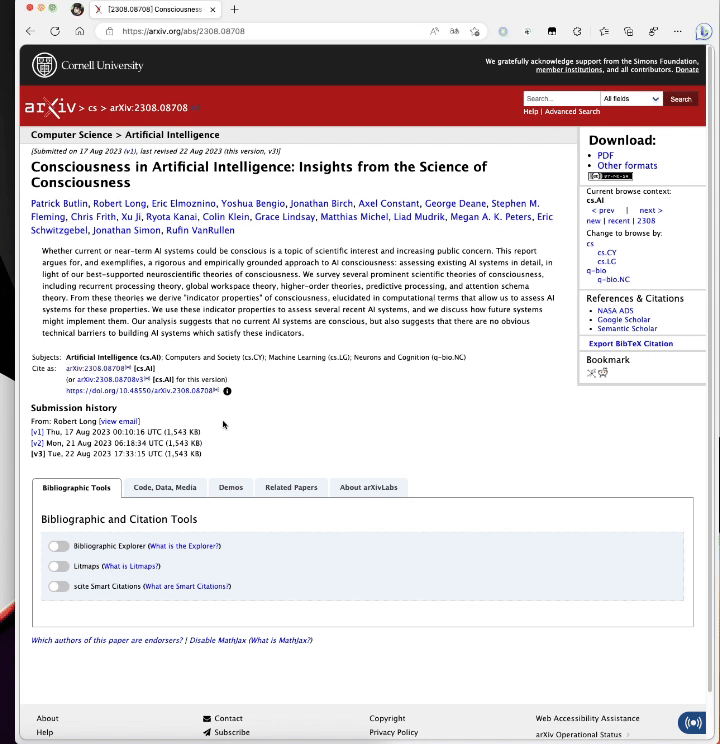

# WebChat

当ChatGPT的能力不能满足我们的需要时，我们常会使用GPT-4或Claude。但GPT-4和Claude的API非常难以获得，后续费用也伤不起。所以将网页版的GPT-4、Claude、Bing集成到了这个称为`WebChat`的功能中。网页版的另一个好处是，虽然有一定时间周期内的使用次数限制，但不消耗token。

## 使用方法一
鼠标悬浮到`新建对话`按钮上后会看到`WebChat`的按钮，打开后和在日常浏览器中使用网页版完全一样，需要登录。

>**这些网站都是禁止国内访问的，软件自动使用`设置`中的`正向代理`地址进行代理。如果无法访问，尝试在`设置->正向代理`中更换你可用的代理地址。**

## 使用方法二

使用"`/`"打开功能标签，选择`ChatGPT-Web`或`Claude-Web`，会自动打开网页版的聊天窗口，并且会自动把输入框中的文字复制进去。包括在使用`Alt+C`和文字对话时候也能生效。

## 其他注意事项
- GPT-4网页版如果字体颜色看不清，在GPT-4内部网页中左上角的菜单中找到setting，然后设置主题和Tianshu的窗口主题一致。
- GPT-4当然要开通了Plus的才能使用，普通的仍然只有GPT-3.5。
- 使用NewBing的时候，如果不能激活AI聊天，在右上角安全限制中选择区域美国。
- 启动后默认不加载`WebChat`，打开一次`WebChat`后才会加载网页。在切换无框模式后，也需要再打开一次。
- 如果内嵌网页出现各种问题，顶上有重新加载按钮。
- `WebChat`页面顶上有缩放按钮，可以放大窗口，以便更好的查看。

