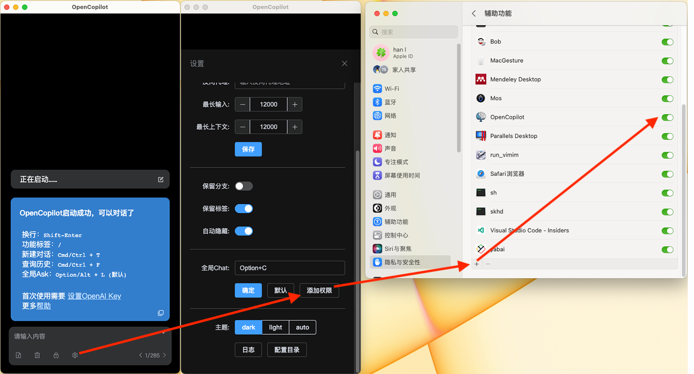

# 全局Chat (AnyChat)

全局Chat功能允许你在系统任何地方调出输入窗口，并对选中的文字内容发起对话。默认快捷键`Option/Alt + C`. 如果和其他系统快捷键有冲突，可以在`设置->全局Chat`中修改。

---

---

> 目前还在测试阶段没有Apple签名，所以在MacOS上使用这个功能，需要在`设置->添加权限->辅助功能`中添加OpenCopilot，否则无法获取文字内容。而且由于没有签名，每次更新版本后需要删除原有项目再重新添加一次。以后完善了再考虑搞个签名。
> 

