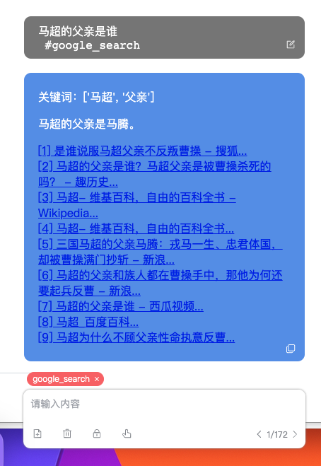

### [agent] 工具、插件和智能体标签

这类标签实际上通过将本地python和LLM结合，完成一些相对高级的功能和自动化操作。可以实现诸如插件、工具甚至智能体。目前主要还是以插件为主，智能体比较依赖GPT4，将在后续逐渐引入。

内置了几个个基本插件作为范例

`/google`：
主要是用于网络搜索改善问答的真实性。插入该标签后，会生成搜索词然联网查询google的结果。

---

`/wiki`：插入该标签后，会查询wikipedia的结果后回答，会读取wikipedia提供的summary来回答问题。

---

`/python`: 可以生成python代码并执行。你可以通过对话完成各种本地文件操作，数据分析，处理 图片、绘图或作为一个简单的notebook调试代码等。依赖本地的python环境，默认会自动查找一个本地的解释器，如果需要指定特定的python环境。在配置文件中`用户文件夹\braindoor\agents\python\config.yaml`声明。下图是一个根据数据绘制图表的完整聊天过程。

---

`/applescirpt` 或 `/vbscript`: 可以生成 applescript 或 vbscript 并执行，可以通过对话完成各种对 MacOS 或 Windows 的操控。比如“创建文件”，“添加一个待办事项”，给“xxx@ss.com发送一个邮件，标题是xx，内容是xx”等自动化操作。ChatGPT 写此类Script错误还比较多，等有gpt4接口后会好很多。Claude 也好一些，正在尝试加入模型。操作 office 也是可以的，可以自己研究下 vbscript。